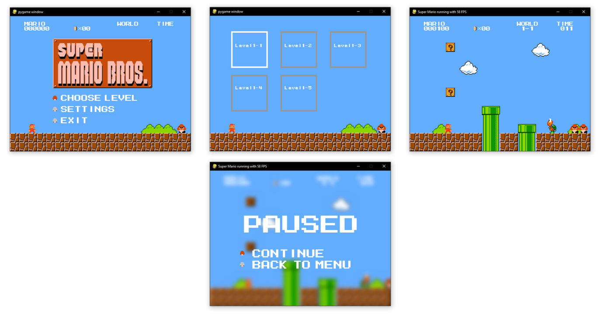

# 🕹️ Super Mario Bros AI Simulator

## 🎯 Project Objective  
This project aims to develop an interactive Super Mario Bros simulator integrating **two intelligent agents** capable of learning to play the game under different levels of knowledge:

- **Agent 1 – Informed Agent**: understands game objects (enemies, bonuses, obstacles) and their functions.  
- **Agent 2 – Naive Agent**: explores the game without prior knowledge, learning everything from scratch.

---

## 🧠 Technical Approach

### 🕵️‍♂️ Agent 1 – Feature-Informed Learning  
- **Inputs**: object types and roles, Mario’s state, relative positions  
- **Model**: neural network + reinforcement learning (e.g., Q-learning or PPO)  
- **Goal**: optimize performance using semantic features to accelerate learning

### 🤖 Agent 2 – Pure Exploration Learning  
- **Inputs**: raw game state (sprites, map layout, environment)  
- **Model**: neural network trained purely via reinforcement learning, with no prior knowledge  
- **Goal**: learn through exploration, like a human discovering the game for the first time

---

## 🏗️ Project Architecture & Technologies

### 🧪 Technologies Used:
- 🐍 Python 3.10+  
- 🎮 Pygame (2D game development)  
- 🧠 PyTorch / TensorFlow (neural model development)  
- 🤖 
- 📊 Pandas, NumPy, Matplotlib (data processing & visualization)  

---

## 📊 Evaluation Goals
- Compare the learning efficiency between the informed and naive agents  
- Visualize decision paths and in-game behavior  
- Analyze how the naive agent discovers game mechanics (e.g., pipes, mushrooms)

---

## 📥 Data & Resources  
- Levels and objects sourced from public Mario datasets (e.g., HuggingFace, GitHub, Spriters Resource), or  
- Programmatically generated for simulation  
- 📄 All third-party resources are credited in `data/README.md`  

---

## 🚀 Running the Project

### Standard Run:
```bash
$ pip install -r requirements.txt
$ python main.py
```

### Windows Standalone Build:
```bash
$ pip install pyinstaller
$ python -m pyinstaller --onefile main.py
```

---

## 🎮 Controls
- **Left Arrow (←)**: Move left  
- **Right Arrow (→)**: Move right  
- **Spacebar**: Jump  
- **Shift**: Boost  
- **Left/Right Mouse Click**: Secret action  

---

## 📷 Current State


---

## 📦 Dependencies
- `pygame`  
- `scipy`  
*(plus others listed in `requirements.txt`)*

---

## 📜 License
This project is for **educational purposes only**.  
Super Mario Bros is a registered trademark of **Nintendo Co., Ltd.**  
No commercial use is intended. All rights to original assets belong to their respective owners.

---

## 👨‍🎓 Authors
Project developed as part of the **ML Proof of Concept 2024–2025** course at *Albert Global Data School*:

- Florent NEGAF  
- Khadidja ADDI  
- Titouan PERRON  

👨‍🏫 **Supervised by**: Gianluca QUERCINI

---
